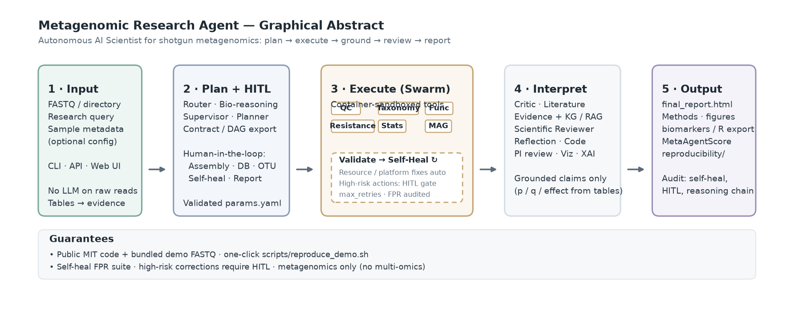

> 中文版: [README.zh-CN.md](README.zh-CN.md)

# Metagenomic Research Agent

[](LICENSE)
[](https://www.python.org/)
[](CHANGELOG.md)

**Autonomous AI Scientist for shotgun metagenomics** — multi-agent planning, container-sandboxed tool execution, evidence-grounded interpretation, and reproducible reporting.

Public repository: [github.com/bio-apple/metagenomic_agent](https://github.com/bio-apple/metagenomic_agent)

## Graphical abstract



<p align="center"><em>Figure 1.</em> End-to-end workflow from FASTQ / research query to audited report. High-risk self-heal actions and compute-heavy steps are gated by human-in-the-loop (HITL). Vector source: <a href="docs/figures/overview.svg"><code>overview.svg</code></a>.</p>

<details>
<summary>Text overview (accessibility)</summary>

```text
Input (FASTQ, query, metadata)
  → Plan + HITL (router, bio-reasoning, planner, DAG / params.yaml)
  → Execute Swarm (QC · Taxonomy · Function · Resistance · Stats · MAG)
       ↺ Validate → Self-Heal (safe auto-fix; high-risk → HITL)
  → Interpret (Critic · Literature · Evidence/KG · Reviewer · Reflection · XAI)
  → Output (final_report.html, Methods, biomarkers, MetaAgentScore, audits)
```

</details>

## Highlights

- **Research-question driven**, not a fixed pipeline wrapper: intent → validated DAG → sandboxed bioinformatics tools.
- **Evidence grounding**: species / *p* / *q* / effect sizes bound to program tables; hybrid RAG + microbiome knowledge graph.
- **Self-heal with reliability controls**: resource/platform retries are automatic; biologically consequential corrections require HITL ([docs/SELF_HEAL.md](docs/SELF_HEAL.md)).
- **Reproducible by design**: engine `params.yaml`, Methods export, one-click mock demo for reviewers.

**Scope:** shotgun / related metagenomics only. No multi-omics expansion.

## Code and data availability

| Resource | Location |
|----------|----------|
| Source code | This repository (public) |
| License | [MIT](LICENSE) |
| Citation | [CITATION.cff](CITATION.cff) |
| Reviewer demo data | [examples/demo_data/](examples/demo_data/) |
| One-click reproduce | [`bash scripts/reproduce_demo.sh`](scripts/reproduce_demo.sh) |
| Tests | [`pytest`](tests/) |

No materials are available “upon request.” The bundled demo uses `--mode mock` for **software** reproducibility; production analyses require reference databases ([database/README.md](database/README.md)).

## Quick start

```bash
git clone https://github.com/bio-apple/metagenomic_agent.git
cd metagenomic_agent
python3 -m venv .venv && source .venv/bin/activate
pip install -e ".[dev]"

# Reviewer path (no reference DBs / GPU)
bash scripts/reproduce_demo.sh
```

Manual equivalent:

```bash
meta-agent run \
  -i examples/demo_data/fastq \
  --metadata examples/demo_data/metadata.tsv \
  -o ./results/demo --mode mock --yes \
  -q "IBD vs healthy gut microbiome biomarker discovery"
# → results/demo/final_report.html
```

Requirements: Python ≥ 3.10. Optional: Docker / Apptainer, `OPENAI_API_KEY` (LLM-enhanced paths only).

Production (real tools + databases):

```bash
meta-agent run -i /data/fastq -o /data/out --mode docker \
  -c config/default.yaml --metadata /data/meta.tsv \
  -q "IBD vs healthy biomarker discovery"
```

Web UI: `meta-agent serve --host 127.0.0.1 --port 8000` → http://127.0.0.1:8000/ui

## Documentation

| Document | Contents |
|----------|----------|
| [docs/USAGE.md](docs/USAGE.md) ([中文](docs/USAGE.zh-CN.md)) | CLI, API, configuration, outputs |
| [docs/ARCHITECTURE.md](docs/ARCHITECTURE.md) ([中文](docs/ARCHITECTURE.zh-CN.md)) | Agents, grounding, HITL, evaluation |
| [docs/SELF_HEAL.md](docs/SELF_HEAL.md) ([中文](docs/SELF_HEAL.zh-CN.md)) | Self-heal FPR analysis and HITL policy |
| [docs/DEPLOY_LINUX.md](docs/DEPLOY_LINUX.md) ([中文](docs/DEPLOY_LINUX.zh-CN.md)) | Linux ≥256 GB / HPC deployment |
| [database/README.md](database/README.md) ([中文](database/README.zh-CN.md)) | Reference database layout and **build steps** |
| [examples/demo_data/README.md](examples/demo_data/README.md) ([中文](examples/demo_data/README.zh-CN.md)) | Reviewer demo data |
| [docs/manuscript/README.md](docs/manuscript/README.md) ([中文](docs/manuscript/README.zh-CN.md)) | Manuscript drafts index |
| [docs/manuscript/application_note.md](docs/manuscript/application_note.md) | **Application Note** manuscript draft (English only) |
| [CHANGELOG.md](CHANGELOG.md) | Version history (English only) |

## Citation

Please cite this repository and `CITATION.cff`. A journal citation will be added upon publication.

## License

[MIT](LICENSE) — © 2026 bio-apple contributors.
